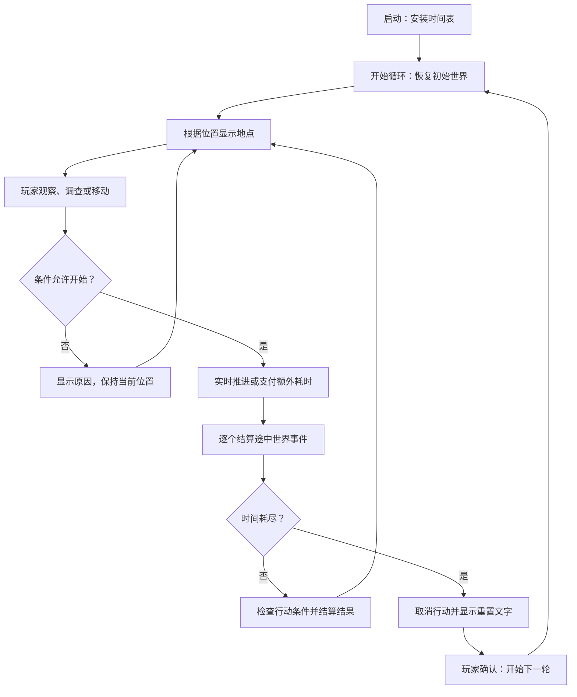

# 时间系统接口与游戏流程构建指南

本文对应当前 `scripts/time/` 下的实现，说明各个公开接口的调用条件、返回值、信号，以及如何用它们组织探索游戏。已有可运行示例是 `scenes/time_system_demo.tscn`，简短说明见 `docs/time_system.md`。

文中的“游戏流程控制器”“地点宿主”和正式地点场景是推荐的后续结构，尚未作为正式游戏内容实现。接口示例使用 GDScript；标为“完整脚本”的示例可挂到满足所列节点结构的场景，其他代码块是函数内片段。

## 阅读导航

- 第 1～2 节：系统组成、时间表、事件和行动资源。
- 第 3～6 节：各个服务的接口、返回值和信号。
- 第 7 节：常驻主流程、地点移动、操作、等待和场景变化的构建示例。
- 第 8～10 节：执行顺序、常见错误和关卡接入验收。

## 1. 先理解数据与时间的关系

系统由四个 Autoload 和三个配置资源组成。

| 类型 | 名称 | 保存或负责的内容 |
| --- | --- | --- |
| 全局服务 | `WorldTime` | 本轮时间、倍率、事件队列、循环阶段 |
| 全局服务 | `WorldState` | 玩家位置、本轮标记、跨轮知识记录 |
| 全局服务 | `ActionController` | 当前行动、条件检查、行动完成与取消 |
| 全局服务 | `PauseController` | 暂停输入、场景树暂停与通知 |
| Resource | `WorldTimeline` | 单轮长度、初始世界和固定事件表 |
| Resource | `WorldTimeEvent` | 某个时刻发生的世界变化 |
| Resource | `WorldAction` | 一次行动的时长、条件、结果和目的地 |

项目中的 Autoload 顺序是 `WorldTime → WorldState → ActionController → PauseController`。保留这个相对顺序：同一世界事件先写入世界数据，再由行动控制器检查条件。

所有地点共享一条从零开始的世界时间轴，单位为秒，允许小数。切换场景不会创建新时钟。未加载的地点仍通过全局事件改变状态，地点加载时读取变化后的结果。

正常运行期间，时钟自动按 `delta × flow_rate` 推进。默认倍率为 `1.0`，即现实运行一秒，世界经过一秒；与现实日期无关。阅读、打开地图、思考和普通对话不会自动暂停。

**不要在地点自己的 `_process()` 中再次调用 `advance_time(delta)`，否则会重复计时。** 当前实现按保持 `Engine.time_scale = 1.0` 的口径工作，世界加速使用自己的倍率接口。

## 2. 配置资源怎么使用

### 2.1 WorldTimeline：一轮游戏的初始规则

| 字段或方法 | 类型 | 用途 |
| --- | --- | --- |
| `loop_duration` | `float` | 循环长度，默认 600 秒，必须为有限正数 |
| `initial_location` | `StringName` | 循环开始时的位置 ID |
| `initial_flags` | `Dictionary` | 本轮标记的初始值 |
| `events` | `Array[WorldTimeEvent]` | 固定事件表 |
| `install() -> bool` | 方法 | 配置时钟和初始世界；不会自动开始或重置循环 |

可以在 Godot 文件系统中创建 `WorldTimeline` 资源并保存为 `.tres`，然后在检查器里填写各字段。当前演示使用 `resources/time/demo_timeline.tres`。

第一次启动的函数内片段：

```gdscript
var timeline: WorldTimeline = preload("res://resources/time/demo_timeline.tres")
if WorldTime.phase == WorldTime.Phase.READY:
	if not timeline.install():
		push_error("时间表配置失败")
		return
	if not WorldTime.start_loop():
		push_error("无法开始第一轮")
```

`install()` 应由游戏启动入口调用一次。普通地点不重复安装。开启下一轮时调用 `start_loop()`，已有时间表会自动重新使用。

### 2.2 WorldTimeEvent：固定或动态的世界事件

| 字段 | 类型 | 规则 |
| --- | --- | --- |
| `event_id` | `StringName` | 不能为空；每轮只能注册一次，即使取消也不能复用 |
| `at_seconds` | `float` | 本轮绝对时间，必须满足 `0 <= 时间 < loop_duration` |
| `priority` | `int` | 同刻时越小越早；相同优先级按注册顺序执行 |
| `changes` | `Dictionary` | 触发时写入 `WorldState` 的标记 |
| `stop_advancement` | `bool` | 默认 false；true 会结束当前这次推进请求，不会暂停整个世界 |

正式世界事件的优先级应小于 `1000000`，该值由行动完成事件使用。不要使用 `_action_completion_` 前缀命名自己的事件，也不要取消这个前缀的事件。

例如“第 180 秒入口开启”：

```gdscript
var event := WorldTimeEvent.new()
event.event_id = &"gate_open"
event.at_seconds = 180.0
event.changes = {&"gate_open": true}
# 启动前，将它加入 WorldTimeline.events；运行中使用 schedule_event()。
```

零时刻事件在世界初始状态恢复后执行。循环终点由时钟专门处理，不能把“第 600 秒循环结束”注册为 600 秒循环中的普通事件。

从第 120 秒跳到第 300 秒时，180 秒、240 秒和 260 秒的事件仍会依次执行，最终呈现 300 秒的世界。不要只根据跳跃后的时间补写终态，否则会丢失中间事件产生的影响。

### 2.3 WorldAction：一次玩家行为

| 字段 | 类型 | 用途 |
| --- | --- | --- |
| `action_id` | `StringName` | 非空行动 ID，用于反馈、分支判断；允许重复执行同一种行动 |
| `display_name` | `String` | 用于 UI 的行动名称 |
| `duration_seconds` | `float` | 有限、非负时长；具体计费口径取决于执行接口 |
| `start_conditions` | `Dictionary` | 开始时必须满足的标记条件 |
| `during_conditions` | `Dictionary` | 开始时及每次世界状态变化时都必须满足 |
| `finish_conditions` | `Dictionary` | 完成时必须满足 |
| `result_changes` | `Dictionary` | 成功后写入的本轮标记 |
| `destination` | `StringName` | 成功后的玩家位置；留空则不移动 |

条件字典使用“所有键对应值都相等”的判断。例如 `{&"gate_open": true, &"power_on": true}` 表示两者都满足。空字典表示没有限制。缺失键不能满足条件，包括要求该键为 false 的情况，因此应在初始标记里明确写出 false。

当前条件字典不解析 `> 180`、逻辑或、脚本表达式、当前位置或知识 ID。复杂规则由业务层检查，或者通过时间事件与操作结果维护一个布尔标记，再交给条件字典检查。

资源在安装或开始行动时会深拷贝；修改原资源不会改变已经排队的事件或已经开始的行动。

## 3. WorldTime 接口参考

### 3.1 可读取的状态

| 属性 | 含义 |
| --- | --- |
| `elapsed_seconds` | 本轮经过的世界秒数 |
| `loop_duration` | 本轮长度 |
| `flow_rate` | 当前世界时间倍率 |
| `loop_index` | 循环编号；启动前为 0，第一次启动为 1 |
| `phase` | `READY`、`RUNNING`、`ENDED` 或 `RESETTING` |

业务代码将这些属性作为只读数据使用。虽然目前是公开变量，也应通过接口改变时间、倍率和阶段，避免绕过事件结算。

| 阶段 | 表示什么 | 时钟是否运行 |
| --- | --- | --- |
| `READY` | 尚未开始第一轮 | 否 |
| `RUNNING` | 正常探索，可进行行动 | 是，场景树暂停时除外 |
| `ENDED` | 已到终点，正常行动终止 | 否 |
| `RESETTING` | 业务层已进入重置展示阶段 | 否 |

暂停是场景树状态，不是第五个循环阶段；暂停中 `phase` 仍可能为 `RUNNING`。

### 3.2 初始化与生命周期

| 接口 | 调用条件与返回值 | 对世界的影响 |
| --- | --- | --- |
| `configure(duration: float, events: Array[WorldTimeEvent]) -> bool` | 非 RUNNING 且不在结算中；长度有效、事件有效、ID 无重复时返回 true | 复制固定时间表并设置循环长度；不改变当前世界标记 |
| `start_loop() -> bool` | 非 RUNNING、不在结算中且未暂停时返回 true | 编号加一；时间归零，倍率恢复 1；重建事件队列并恢复世界初始状态 |
| `begin_reset() -> bool` | 仅 ENDED、不在结算中且未暂停时返回 true | 切换到 RESETTING；不自动播放 UI，也不自动开启下一轮 |

通常使用 `WorldTimeline.install()` 代替分别调用 `configure()` 和 `WorldState.configure_initial()`。

`start_loop()` 不会修改固定规则，也不会清空知识记录。它可以从 ENDED 开始，但推荐通过 `begin_reset()` 明确组织重置展示。它不会自动把实际场景切换回起点，流程控制器需要根据恢复后的 `player_location` 切换显示内容。

### 3.3 推进和倍率

| 接口 | 返回值与规则 | 适合的用途 |
| --- | --- | --- |
| `can_advance() -> bool` | 仅检查 RUNNING 且未暂停；不包含忙碌或重入检查 | 按钮及业务入口的运行状态判断 |
| `is_advancing() -> bool` | 当前是否正在同步结算时间事件 | 避免回调中重入推进或开始行动 |
| `advance_time(seconds: float) -> float` | 返回实际经过的世界秒数；负数、非有限值、暂停、非 RUNNING、重入时返回 0 | 额外时间消耗；优先由行动控制器调用 |
| `skip_to(target_seconds: float) -> float` | 跳到本轮绝对时刻，返回实际经过时长；不允许倒退 | 等待到某时刻、调试跳跃 |
| `set_flow_rate(value: float) -> bool` | 仅运行且未暂停时接受有限正数 | 持续改变世界倍率；调用方负责恢复 |
| `get_remaining_seconds() -> float` | 返回不小于 0 的剩余秒数 | HUD、行动前的剩余时间提示 |

`advance_time()`、`skip_to()` 不保证完整推进到请求的目标：循环终点、行动完成、执行条件失效、事件请求停止或中途暂停都可能使它们提前结束。总是读取返回值或最新时间，不根据请求值猜测结果。

`advance_time(0.0)` 可以处理当前时刻已经注册、尚未触发的事件。`skip_to()` 的目标是本轮时间，不是“再经过多少秒”：在 120 秒调用 `skip_to(180.0)` 请求经过的是 60 秒。

```gdscript
# 函数内：在空闲状态下跳到第 3 分钟。
if WorldTime.can_advance() and not ActionController.is_busy():
	var advanced := WorldTime.skip_to(180.0)
	print("实际经过：", advanced, "；当前：", WorldTime.elapsed_seconds)
```

对于带结果、目的地或条件的行为，使用 `WorldAction`；不要先 `advance_time()` 再手动移动，否则容易忽略途中循环结束和失败条件。

`set_flow_rate()` 没有专门的倍率变化信号。手动设置倍率后，调用方需要刷新倍率显示；`time_changed` 在后续时间变化时也会刷新时钟。持续等待通常使用 `execute_timed()`，由行动控制器自动恢复开始前的倍率。

### 3.4 动态事件与中止

| 接口 | 规则 |
| --- | --- |
| `schedule_event(event: WorldTimeEvent) -> bool` | 必须有效、不早于当前时间、本轮 ID 未使用；成功注册的是资源副本 |
| `cancel_event(event_id: StringName) -> void` | 移除尚未触发的对应事件；不撤销已经写入的世界变化；ID 本轮仍不能复用 |
| `request_stop() -> void` | 只在当前同步推进中设置停止请求；同刻事件仍按队列处理，除非场景树已经暂停 |

动态事件适合“操作完成 20 秒后通电”。在操作成功回调中可以注册未来事件：

```gdscript
var event := WorldTimeEvent.new()
event.event_id = &"power_on_after_switch"
event.at_seconds = WorldTime.elapsed_seconds + 20.0
event.changes = {&"power_on": true}
if not WorldTime.schedule_event(event):
	# 例如：事件时刻已经到达循环终点，或本轮已注册过这个 ID。
	print("本轮无法安排通电事件")
```

该 ID 每轮只安排一次。如果玩法允许重复开关，需要由业务层生成不同 ID，并保存所需取消的 ID。

`schedule_event()` 和 `cancel_event()` 本身没有暂停或运行阶段检查；业务入口应主动检查 `can_advance()`。不要在启动前用 `schedule_event()` 配置固定事件，因为 `start_loop()` 会清空临时队列；固定事件放入 `WorldTimeline.events`。

`request_stop()` 和 `stop_advancement` 都只结束当前请求。自动逐帧计时仍可能在同一帧处理剩余现实时间，它们不能代替暂停或循环结束。

### 3.5 信号

| 信号 | 发出时机 | 常见监听者 |
| --- | --- | --- |
| `time_changed(previous_seconds, current_seconds)` | 每段有时间变化的推进，以及启动时的 `(0, 0)` | 时钟 HUD、连续参数缓存 |
| `event_reached(event)` | 时钟到达并取出某个事件 | 事件提示、音效、额外世界逻辑 |
| `loop_reset(loop_index)` | 新一轮初始恢复阶段，零时刻事件之前 | 重建本轮临时对象 |
| `loop_started(loop_index)` | 初始世界和零时刻事件处理完毕 | 关闭重置界面、显示起点、开始本轮提示 |
| `loop_ended(loop_index)` | 时间触及终点，阶段已经变为 ENDED | 重置流程控制器 |

一次跳跃可能多次发出 `time_changed`，经过每个事件时刻都会产生时间边界；不要把每次信号当作一个现实帧。`event_reached` 也包含行动控制器生成的内部完成事件，业务层应按自己的事件 ID 过滤。

事件回调以及 `loop_reset`、`loop_ended` 回调发生在同步结算期间。在这些回调中直接调用 `start_loop()` 或开始另一个行动会被拒绝。用 `call_deferred()`，并在延迟函数中重新检查阶段和当前循环编号。`loop_started` 已在结算标记释放之后发出。

## 4. WorldState 接口参考

| 接口或属性 | 返回值与行为 |
| --- | --- |
| `player_location: StringName` | 当前逻辑位置 ID；本身不是一个场景文件路径 |
| `configure_initial(flags: Dictionary, location: StringName) -> bool` | 非 RUNNING 且不在结算中时复制初始数据；下次 `start_loop()` 才应用 |
| `get_flag(key: StringName, fallback: Variant = null) -> Variant` | 读取本轮标记；缺失时返回 fallback |
| `get_flags() -> Dictionary` | 返回全部本轮标记的深拷贝；修改副本不会改变世界 |
| `meets_conditions(conditions: Dictionary) -> bool` | 所有键存在且等于要求值时返回 true；空条件返回 true |
| `apply_changes(changes: Dictionary, destination: StringName = &"") -> bool` | 运行且未暂停时写入标记，可同时写入非空位置；最后发出一次 `state_changed` |
| `move_to(location: StringName) -> bool` | 运行且未暂停时写入非空位置并发出 `state_changed`；不消耗时间 |
| `record_knowledge(knowledge_id: StringName) -> bool` | 运行且未暂停时记录非空知识 ID；重复记录成功但不重复发信号 |
| `knows(knowledge_id: StringName) -> bool` | 查询跨轮知识记录 |

`apply_changes({}, &"")` 会返回 true，但不发出状态信号。位置和标记一起提交时具有原子性：监听者不会看到位置已经改变但结果尚未写入的状态。

`get_flag()` 不会深拷贝返回的容器值。标记通常使用布尔、数字和字符串；如果读取数组或字典后需要修改，先取 `get_flags()` 的副本，再通过 `apply_changes()` 提交，保证行动条件能收到状态通知。

```gdscript
# 函数内：不耗时的即时操作。业务层仍需要检查地点和行动是否忙碌。
if WorldTime.can_advance() and not ActionController.is_busy():
	WorldState.apply_changes({&"switch_on": true})

# 获取知识不会自动打开本轮入口。
WorldState.record_knowledge(&"gate_method")
var show_hint := WorldState.knows(&"gate_method")
var can_enter := WorldState.meets_conditions({&"gate_open": true})
```

`state_changed` 无参数，通知位置或本轮标记变化，以及循环初始状态恢复。`knowledge_changed` 无参数，只通知新增知识。地点描述监听前者，知识笔记监听后者。

知识记录当前只保存在进程内，跨循环保留，但退出游戏后不会自动存盘。地点的发现规则也尚未内建：可选择本轮标记保存发现状态，或用知识记录控制地图提示；进入条件仍由本轮标记判断。

## 5. ActionController 接口参考

| 接口 | 返回值与行为 |
| --- | --- |
| `is_busy() -> bool` | 当前是否存在正在执行的行动 |
| `get_active_action() -> WorldAction` | 活动行动的深拷贝；空闲时为 null |
| `execute_instant(action: WorldAction) -> bool` | 同步支付额外耗时并结算；true 表示接受行动，不保证成功 |
| `execute_timed(action: WorldAction, rate: float = 1.0) -> bool` | 在后续帧持续执行，临时使用指定正倍率；true 表示接受行动 |
| `cancel_action(reason: StringName = &"cancelled") -> bool` | 运行且未暂停时取消活动行动；取消未来完成事件，恢复之前倍率，并通知失败 |

开始行动要求：世界正在运行、未暂停、不在时间结算中、控制器空闲、资源有效，开始条件和执行期间条件都满足。条件不满足时直接返回 false，不消耗时间，也不发送 `action_started` / `action_finished`。

同一时间只能执行一个行动。UI 按钮可根据 `is_busy()` 禁用，但控制器仍会在入口再次检查。

### 5.1 两种耗时口径

| 执行方式 | `duration_seconds = 60` 的含义 | 何时使用 |
| --- | --- | --- |
| `execute_instant()` | 当前世界时间立即额外推进 60 秒；实际现实播放时间仍由正常时钟另外计入 | 点击地点移动、文字调查、直接跳过等待 |
| `execute_timed(action, 1.0)` | 在后续帧累计经过 60 世界秒，约需 60 现实秒 | 需要持续进行、可取消的行动 |
| `execute_timed(action, 10.0)` | 在后续帧累计经过 60 世界秒，约需 6 现实秒 | 加速等待、可中断的快速执行 |

例如移动演出额外播放 2 秒，瞬时行动再额外扣 60 秒，总耗时为 62 世界秒。持续行动已经通过逐帧推进计入时长，完成后不能再调用 `advance_time(60)`。

瞬时行动在单次函数调用中完成，玩家无法在这次同步跳跃的中间按暂停；需要中途暂停的行为选择持续执行。持续行动的暂停不消耗时间，取消后不扣除剩余时长。

开始持续行动时保存原倍率；完成或取消后恢复该倍率，不一定是 1。默认世界倍率为 1 时，完成后就恢复为 1。期间不要由其他系统随意覆盖倍率，以免与恢复规则冲突。

### 5.2 条件时机与失败

| 条件或情况 | 检查时刻 | 失败结果 |
| --- | --- | --- |
| 开始条件 | 请求开始时 | 拒绝，不耗时 |
| 执行期间条件 | 开始时及每次 `state_changed` | 行动取消；瞬时推进停在失效边界，未使用时长不再收取 |
| 完成条件 | 完成事件触发时 | 已支付实际行动耗时，但不写目的地或结果 |
| 循环终点 | 时间到达终点 | 行动取消，结果不提交，即使完成时刻恰好是终点 |

执行期间检查基于状态变化通知，不会自动采样自定义的连续表达式。要表达“第 260 秒通道变危险”，在 260 秒事件中设置 `passage_safe = false`，把该标记放入 `during_conditions`。

同刻的普通世界事件先执行，行动完成随后检查最终状态。期间条件一旦失效就取消；后续同刻或之后的事件重新使条件成立，也不会恢复这次行动。

### 5.3 信号和 reason

`action_started(action)` 在接受行动后发出。`action_finished(action, succeeded, reason)` 在完成、失败或取消时发出。失败不自动播放文字或动画，由监听者提供反馈。

| `reason` | `succeeded` | 含义 |
| --- | --- | --- |
| `&"completed"` | true | 行动完成并提交结果 |
| `&"finish_condition"` | false | 完成条件不成立 |
| `&"during_condition"` | false | 执行期间条件失效 |
| `&"loop_ended"` | false | 时间耗尽 |
| `&"cancelled"` 或自定义取消原因 | false | 业务层调用取消 |

**先连接信号，再开始行动。** 瞬时行动和零时长行动可能在 `execute_instant()` 或 `execute_timed()` 返回之前发出完成信号，调用之后才连接会漏掉结果。

```gdscript
# 放在节点脚本中；在 _ready() 连接一次，不在每次点击时反复连接。
func _ready() -> void:
	ActionController.action_finished.connect(_on_action_finished)

func _on_action_finished(action: WorldAction, succeeded: bool, reason: StringName) -> void:
	if action.action_id != &"travel_to_observatory":
		return
	if succeeded:
		print("已经到达：", WorldState.player_location)
	else:
		print("移动失败：", reason)
```

行动成功时位置已经由 `destination` 写入，不需要在完成回调中再次调用 `move_to()`。在完成回调中串联下一行动需要延迟，且延迟函数中重新检查世界阶段与循环编号。

## 6. PauseController 与菜单

唯一公开方法为 `set_paused(value: bool) -> void`。它修改 `get_tree().paused`；状态实际改变时发出 `pause_changed(paused: bool)`，重复设置同一个值不发信号。

默认 `pause_game` 输入动作绑定物理 Esc 按键。控制器设为 `Always`，即使暂停也能接收恢复输入。可以在项目输入映射中修改按键。

建议的节点处理模式：

| 节点 | Process Mode |
| --- | --- |
| 游戏内容、地点宿主、普通 HUD | Pausable 或继承游戏根节点 |
| 暂停输入控制器 | Always，已经由脚本设置 |
| 暂停菜单 | When Paused |
| 循环结束/重置界面 | Pausable；循环结束无需把场景树暂停 |

暂停菜单完整脚本，挂在含 `ResumeButton` 的 `Control` 上：

```gdscript
extends Control

func _ready() -> void:
	process_mode = Node.PROCESS_MODE_WHEN_PAUSED
	PauseController.pause_changed.connect(_on_pause_changed)
	$ResumeButton.pressed.connect(_resume)
	# 信号只通知变化，进入场景时仍要主动读取当前状态。
	_on_pause_changed(get_tree().paused)

func _resume() -> void:
	PauseController.set_paused(false)

func _on_pause_changed(paused: bool) -> void:
	visible = paused
```

通过控制器暂停可以保证 UI 收到通知；直接赋值 `get_tree().paused` 不会自动发出 `pause_changed`。Godot 暂停期间信号回调仍可能执行，所以业务按钮和自定义世界逻辑也应检查运行状态，不能只依赖节点不再逐帧处理。

## 7. 游戏流程怎么组织

### 7.1 推荐场景结构

```text
GameRoot（长期存在，挂 GameFlow 脚本）
├── LocationHost（当前地点场景的父节点）
├── WorldHUD（时间、状态、地图入口）
├── PauseMenu（When Paused）
│   └── ResumeButton
└── LoopResetPanel（循环结束文字）
	└── ContinueButton
```

`LocationHost` 只替换地点子场景，HUD、暂停菜单和流程控制器保持存在。`WorldState.player_location` 是逻辑位置，流程控制器维护“位置 ID → PackedScene”的映射。

这种结构让移动失败时保留原地点；成功后再依据全局位置切换显示。地点节点无需持有旧行动的完成回调来维持主流程，行动失败提示可由常驻 HUD 监听。



图中每次结算期间，普通实时计时也持续运行。循环结束的文字期间，时钟因阶段不是 RUNNING 而停止。

### 7.2 常驻流程控制器完整示例

下面的示例不会新增时间机制，只组织现有服务。将它挂到上述 `GameRoot`，在检查器指定 `timeline` 和 `location_scenes`；字典使用 `StringName` 位置 ID 作为键、对应地点的 `PackedScene` 作为值。

`LocationHost`、`LoopResetPanel` 和 `ContinueButton` 是示例需要你创建的节点。正式地点场景由项目后续实现，示例不会自动生成它们。

```gdscript
extends Control

@export var timeline: WorldTimeline
@export var location_scenes: Dictionary = {}

@onready var location_host: Node = $LocationHost
@onready var reset_panel: Control = $LoopResetPanel

var _shown_location: StringName = &""
var _sync_queued: bool = false

func _ready() -> void:
	WorldState.state_changed.connect(_queue_location_sync)
	WorldTime.loop_started.connect(_on_loop_started)
	WorldTime.loop_ended.connect(_on_loop_ended)
	$LoopResetPanel/ContinueButton.pressed.connect(_continue_loop)
	reset_panel.hide()
	if WorldTime.phase == WorldTime.Phase.READY:
		if timeline == null or not timeline.install():
			push_error("未指定有效时间表")
			return
		WorldTime.start_loop()
	else:
		reset_panel.visible = WorldTime.phase != WorldTime.Phase.RUNNING
		_queue_location_sync()

func _queue_location_sync() -> void:
	# 状态信号可能来自时间事件结算，场景替换统一延迟到结算结束。
	if _sync_queued:
		return
	_sync_queued = true
	_sync_location.call_deferred()

func _sync_location() -> void:
	_sync_queued = false
	if WorldTime.phase != WorldTime.Phase.RUNNING:
		return
	var location := WorldState.player_location
	if location == _shown_location:
		return
	var scene := location_scenes.get(location) as PackedScene
	if scene == null:
		push_error("缺少地点场景：" + String(location))
		return
	for child in location_host.get_children():
		location_host.remove_child(child)
		child.queue_free()
	location_host.add_child(scene.instantiate())
	_shown_location = location

func _on_loop_started(_loop_index: int) -> void:
	reset_panel.hide()
	# 起点 ID 即使与上一轮相同，也要重建地点里的临时节点。
	_shown_location = &""
	_queue_location_sync()

func _on_loop_ended(loop_index: int) -> void:
	# loop_ended 在同步结算内部发出，不能这里直接 begin_reset()。
	_show_reset.call_deferred(loop_index)

func _show_reset(expected_loop: int) -> void:
	# 避免迟到回调影响另一个循环。
	if WorldTime.loop_index != expected_loop:
		return
	if WorldTime.phase == WorldTime.Phase.ENDED:
		WorldTime.begin_reset()
	reset_panel.visible = WorldTime.phase in [WorldTime.Phase.ENDED, WorldTime.Phase.RESETTING]

func _continue_loop() -> void:
	# 暂停中不能开始下一轮；界面可提示玩家先关闭暂停菜单。
	if get_tree().paused or WorldTime.is_advancing():
		return
	if WorldTime.phase == WorldTime.Phase.ENDED:
		WorldTime.begin_reset()
	if WorldTime.phase == WorldTime.Phase.RESETTING:
		WorldTime.start_loop()
```

该示例通过全局状态切换地点，而不是根据按钮请求的目的地直接换场景。这样途中入口关闭、循环结束或行动失败都不会造成“画面到了目的地，但逻辑位置仍在原处”。

### 7.3 地点内构建移动行为

以下完整节点脚本需要 `TravelButton`，以及 UI 自行显示结果的位置。开始前检查当前地点，移动后的逻辑位置由行动配置决定。

```gdscript
extends Control

func _ready() -> void:
	$TravelButton.pressed.connect(_travel)
	WorldState.state_changed.connect(_refresh)
	ActionController.action_started.connect(_on_action_started)
	ActionController.action_finished.connect(_on_action_finished)
	WorldTime.loop_started.connect(_on_loop_started)
	WorldTime.loop_ended.connect(_on_loop_ended)
	_refresh()

func _refresh() -> void:
	$TravelButton.disabled = not WorldTime.can_advance() \
		or ActionController.is_busy() \
		or not WorldState.meets_conditions({&"gate_open": true})

func _travel() -> void:
	if WorldState.player_location != &"harbor":
		return
	var action := WorldAction.new()
	action.action_id = &"travel_to_observatory"
	action.display_name = "前往观测站"
	action.duration_seconds = 60.0
	action.start_conditions = {&"gate_open": true}
	action.finish_conditions = {&"gate_open": true}
	action.destination = &"observatory"
	if not ActionController.execute_instant(action):
		print("当前无法开始移动")

func _on_action_started(_action: WorldAction) -> void:
	_refresh()

func _on_action_finished(_action: WorldAction, _succeeded: bool, _reason: StringName) -> void:
	_refresh()

func _on_loop_started(_loop_index: int) -> void:
	_refresh()

func _on_loop_ended(_loop_index: int) -> void:
	_refresh()
```

如果路线要求“出发时入口打开即可”，只设置开始条件。如果要求“到达时仍打开”，增加完成条件。如果要求“全过程保持打开”，增加执行期间条件。三者对应不同玩法，不应全部路线都套用同一种规则。

常驻 HUD 可以按行动 ID 判断移动成功或失败，并显示反馈。不要在瞬时调用返回后固定播放“成功到达”；应根据 `action_finished` 的真实结果播放。

### 7.4 调查、操作和知识积累

调查和操作可以复用相同的行动配置：

```gdscript
# 函数内：30 秒后根据装置是否运行决定研究结果。
var research := WorldAction.new()
research.action_id = &"research_machine"
research.display_name = "研究装置"
research.duration_seconds = 30.0
research.finish_conditions = {&"machine_running": true}
research.result_changes = {&"deciphered": true}
ActionController.execute_instant(research)
```

在常驻知识或反馈节点中连接 `action_finished`，成功时执行：

```gdscript
if succeeded and action.action_id == &"research_machine":
	WorldState.record_knowledge(&"machine_method")
```

这里 `deciphered` 是本轮操作结果，重置后恢复初始值；`machine_method` 是知识记录，下一轮仍保留。后续进入条件应要求本轮实际前置操作，不能只因玩家已记录方法就自动打开入口。

知识记录可供提示和笔记使用。设计文档中的知识锁还依赖玩家理解与主动操作，当前系统不会判断玩家脑中是否掌握知识，也不会自动限制玩家尝试正确方法。

### 7.5 等待、快进与取消

```gdscript
# 函数内：选择持续快进，支持中途 Esc 暂停。
var wait := WorldAction.new()
wait.action_id = &"wait_one_minute"
wait.display_name = "等待一分钟"
wait.duration_seconds = 60.0
ActionController.execute_timed(wait, 10.0)

# 另一个取消按钮回调：只在未暂停且忙碌时启用。
# ActionController.cancel_action()
```

等待到绝对时刻时，用 `maxf(0.0, target - WorldTime.elapsed_seconds)` 作为持续行动时长。如果目标已经过去，应由 UI 解释“本轮时机已过”，而不是把过去时刻当作下一轮同一时刻。

加速影响共享世界时钟，所有地点同时加速；地点自身不需要额外快进。普通文本打字、按钮动画等表现效果可以按普通帧时间播放，世界现象则根据世界时间计算。

### 7.6 地点随时间变化的两种方式

**离散规则使用事件和标记。** 入口开关、装置启动、建筑损毁、道路危险等通过 `WorldTimeEvent.changes` 更新。地点进入时读取 `WorldState`，并监听 `state_changed` 刷新描述和选项。

**连续表现根据当前时间计算。** 太阳颜色、轨道位置和倒计时不必排很多事件。下面是一个连续参数的节点脚本：

```gdscript
extends Node2D

func _process(_delta: float) -> void:
	var progress := clampf(WorldTime.elapsed_seconds / WorldTime.loop_duration, 0.0, 1.0)
	# 当前时间决定表现，跳跃和重置都会立即得到对应结果。
	modulate = Color.WHITE.lerp(Color("ff7755"), progress)
```

如果连续变化会影响行动条件，仍需把关键阈值配置为离散事件，例如“进度达到某阶段后不可通行”。只改变画面不会自动改变行动判断。

## 8. 正常行动与重置的精确顺序

### 8.1 一次带耗时行动

1. 接收按钮请求，检查世界运行、未暂停、非结算中且没有其他行动。
2. 检查开始条件和执行期间条件；失败直接返回 false。
3. 复制行动资源，安排完成事件，发出 `action_started`。
4. 瞬时行动同步推进额外时间；持续行动在后续帧推进。
5. 每经过事件时刻，先写入世界标记，再检查执行期间条件。
6. 到达完成时刻，在普通世界事件之后检查完成条件。
7. 先清理活动行动和完成事件，恢复原倍率；成功时再一次提交结果标记和位置，失败时不提交结果。
8. 发出 `action_finished`，由业务层显示反馈。

监听 `action_finished` 时结果已经提交，控制器已经空闲，但仍可能处于世界时间的同步结算中。先清理活动行动再提交结果，可以避免结果产生的状态通知取消自己。

### 8.2 时间触及终点

1. 时间被截断到 `loop_duration`，阶段改为 ENDED，倍率恢复为 1。
2. 待执行事件清空，发出终点的 `time_changed`。
3. 发出 `loop_ended`；行动控制器取消尚未完成的行动，原因是 `loop_ended`。
4. 业务层通过延迟回调进入 RESETTING，并显示重置文字。
5. 玩家确认后调用 `start_loop()`。
6. 新一轮时间归零、编号加一，固定事件重新排队；`loop_reset` 恢复初始标记和玩家位置。
7. 处理零时刻事件，发出启动时间通知和 `loop_started`，地点显示重新构建。

单次大跳跃不会在同一次请求中继续进入下一轮，剩余耗时不会带过去。循环结束不会自动卸载地点、播放重置文字或清空你另外创建的临时节点；这些由常驻流程控制器组织。

## 9. 现有实现的边界与常见错误

| 容易误用的方式 | 正确做法 |
| --- | --- |
| 每进入地点都 `install()` / `start_loop()` | 启动入口安装一次；地点只读取全局状态 |
| 在所有地点中叠加自己的世界时钟 | 使用唯一的 `WorldTime`，连续表现读取当前时间 |
| `execute_instant()` 返回 true 就显示成功 | 监听完成信号，读取 succeeded 和 reason |
| 调用瞬时行动后才连接结果信号 | 在 `_ready()` 预先连接一次 |
| 先推进，再不检查状态就换场景 | 用行动的 destination；流程层根据全局位置切换 |
| 持续行动完成后再扣一次 duration | 持续执行已计入时间，不重复收费 |
| 用 `set_flow_rate(0)` 暂停 | 使用 `PauseController.set_paused(true)` |
| 在 `loop_ended` 回调里直接重置 | 延迟到结算结束，再调用 begin_reset / start_loop |
| 在上一行动完成回调中直接开始下一行动 | 延迟执行，重新检查阶段与循环编号 |
| 只在目标时刻设置最终状态 | 按事件表依次结算途中变化 |
| 把知识记录直接当成本轮进入条件 | 知识用于理解与提示，本轮实际操作用世界标记 |
| 修改 get_flag 返回的数组以改变世界 | 修改副本，再通过 apply_changes 发出状态通知 |
| 暂停菜单继承 Pausable | 菜单使用 When Paused，恢复输入使用 Always |
| 知识记录等同于存档 | 当前只在内存中保存；跨进程保存需另做存档层 |

当前实现提供时间与行动机制，不包含正式地点路由、完整知识笔记 UI、存档读写、胜利结局流程或复杂条件表达式。构建正式关卡时将这些放在业务层，不应在地点脚本中复制另一套时间机制。

## 10. 建议的接入顺序与验收

1. 新建正式 `WorldTimeline`，确定循环长度、起点和全部初始标记。
2. 配置固定时间事件；检查所有时间都早于循环终点、事件 ID 没有重复。
3. 建立常驻 GameRoot、地点宿主、HUD、暂停菜单和重置界面。
4. 绑定位置 ID 与地点场景，先打通第一轮启动及循环结束返回起点。
5. 把移动、调查、操作制作成 WorldAction，明确条件的检查时机。
6. 为地点连接状态通知，为 HUD 连接时间与行动通知，为笔记连接知识通知。
7. 添加等待、快进和取消按钮；明确是否需要中途暂停。
8. 验证未访问地点的变化、途中条件失效、终点取消和第二轮重置。

已有 `tests/time_system_test.tscn` 可通过 Godot headless 运行。正式关卡还需检查内容规则，例如：

| 场景 | 预期结果 |
| --- | --- |
| 入口打开前请求进入 | 不开始、不收取行动耗时 |
| 出发时可进入，到达前入口关闭 | 按该路线的完成/期间条件决定失败 |
| 跳过多个关键时刻 | 事件有序发生，中间产生的影响不丢失 |
| 快进中按 Esc | 时间和行动冻结，恢复后继续 |
| 玩家一直不访问某地点 | 该地点仍按时间表改变 |
| 行动完成时刻等于终点 | 行动失败，进入重置展示 |
| 下一轮再次到达相同时刻 | 固定事件重复发生，本轮结果清空、知识保留 |

示例中的 180 秒入口开启、240 秒装置启动、260 秒入口关闭和 600 秒终点只是演示时间表。正式剧情规则可以替换资源配置，无需重写时钟服务。
